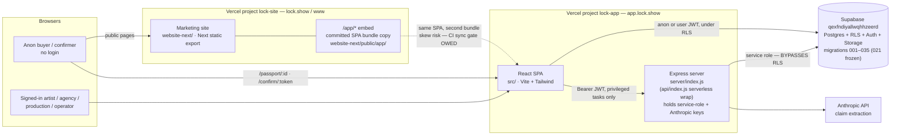
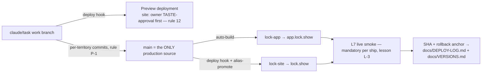

# LOCK — ARCHITECTURE MAP (the one consolidated map)

_T-38 (Team G, Wave 3). This file is a **MAP, not canon** — every section cites the source doc
that owns the truth; when this map and a source disagree, the source wins and this map gets
fixed. Consolidates: spec §3 + §13 (`docs/LOCK-PRODUCT-SPECIFICATION.md`),
`docs/PASSPORT-ARCHITECTURE.md`, `docs/CODEX-FUNCTIONAL-CONTRACTS.md`,
`GIGPROOF-DB-STRUCTURE.md`, `docs/SITE-MANAGEMENT.md` §2, `docs/TASK-REGISTER.md` (TEAMS).
Firewall (spec §2) governs every box below: no score / percentile / rank / gauge anywhere —
draw is bands + binaries + method labels only._

---

## 1. System diagram

_Source: spec §13.1 (surfaces, stack, request flow) · `docs/SITE-MANAGEMENT.md` §2 (site/embed
split) · spec §13.4.4 (SPA rewrites)._



Two live data paths by design (spec §13.1.3): **direct-to-Supabase** (primary; RLS + column
grants are the enforcement; works with no server, `NO_API_DEPLOY`) and **via Express** (only
when the service role or the Anthropic key is required). Entity spine behind all data: **Person
→ Membership → Role → Workspace**, multi-**Act** fan-out per Person (evidence per-Act,
non-transferable, `passport_version.act_id` binds Passport→Act), **ArtistAccess** as a separate
consent axis — spec §3, `GIGPROOF-DB-STRUCTURE.md`, `docs/CODEX-FUNCTIONAL-CONTRACTS.md` §1.

---

## 2. Data flow — the three core journeys

### 2.1 Artist: evidence → claim → passport

_Source: spec §13.3 (endpoints, `buildSafePayload`), §13.5.2 (`artist_approved` gate),
`docs/PASSPORT-ARCHITECTURE.md` (views)._

```mermaid
sequenceDiagram
  actor A as Artist (SPA, JWT)
  participant DB as Supabase (RLS)
  participant S as Express (service role)
  participant AI as Anthropic
  A->>DB: upload file → Storage; insert evidence_artifacts (status=submitted)
  A->>S: POST /api/process-evidence {artistId} (Bearer + owner gate)
  S->>AI: extract claims (stub/degraded fallback, provenance recorded)
  S->>DB: insert claims — artist_approved=FALSE, internal_confidence DB-only
  A->>DB: review in Radar → approve claim (artist_approved=true, visibility=passport-ok)
  A->>DB: publish — pv_owner_insert snapshot (017) or POST /api/publish/:artistId
  DB-->>DB: passport_versions row = immutable buyer-safe snapshot (act_id-bound)
```

Nothing reaches any public view without `artist_approved = true` — enforced in **four**
lockstep read paths (RLS 031 · server `buildSafePayload` · client authed branch · snapshot
builder), spec §13.5.2. The firewall transform for rendering lives in
`src/features/passport/passportKit.jsx` `deriveSections()` (`docs/PASSPORT-ARCHITECTURE.md`).

### 2.2 Buyer: view → reaction → request

_Source: spec §13.3.1 (public endpoints), §13.5.1 (anon RLS), `docs/PASSPORT-ARCHITECTURE.md`
(two personas, one set of facts)._

```mermaid
sequenceDiagram
  actor B as Buyer (anon, no login)
  participant SPA as SPA /passport/:id
  participant DB as Supabase (anon grants 016/025)
  participant S as Express
  actor AR as Artist
  B->>SPA: open shared link (?view=rep optional; persona = order/framing only)
  SPA->>DB: read snapshot / passport-ok+approved claims (column-granted only)
  SPA->>DB: insert passport_view_event (published artists only; a view ≠ a reaction)
  B->>DB: one-tap professional_reaction (idempotency_key) — or POST /api/passport-signal
  B->>S: POST /api/availability-request (closed field list, bands only)
  S->>DB: insert availability_requests + server-authored notification
  DB-->>AR: bell rings (notifications, notif_self RLS)
```

Reaction insight returns to the artist as method-safe **text only** — never a count/%/score
(CLAUDE.md firewall; spec §2.5).

### 2.3 Source-Confirmer: the token loop

_Source: spec §13.3.1 + §13.4.2 (token TTL) · spec §3.4 family 5 (accountless — the D3 rule) ·
`GIGPROOF-DB-STRUCTURE.md` Layer 6._

```mermaid
sequenceDiagram
  actor A as Artist (JWT)
  participant S as Express
  participant DB as Supabase
  actor P as Confirmer (accountless)
  A->>S: POST /api/request-confirmation {claimId} → mints token (14-day TTL)
  A-->>P: sends magic link /confirm/:token (off-platform)
  P->>S: GET /api/confirm/:token → safe fields only (claimText, artistName)
  P->>S: POST response yes | partial | no | wrong_person (or revoke)
  S->>DB: record producer_confirmations; ONLY "yes" earns method label producer-confirmed
```

The confirmer is **never** a workspace/dashboard — one bounded task at `/confirm/:token`
(spec §3.8 defect D3). Token stored plaintext today; hashing = migration 036 DRAFT (spec §13.2.1).

---

## 3. Trust boundaries (anon / auth / service-role)

_Source: spec §13.1.4, §13.5 (RLS catalog, service-role risk, rate limits)._

| Boundary | Who | Enforcement | Notes |
|---|---|---|---|
| **Anon browser ↔ Postgres** | public buyer, waitlist, view/reaction inserts | RLS row policies + **per-column anon GRANTs** (migrations 016/025) — the DB *is* the firewall | anon key is public by design; private columns (`rider_url`, `whatsapp_number`, `exact_count`, `internal_confidence`) are not granted, so they physically cannot be selected |
| **Authenticated browser ↔ Postgres** | artist/org member JWT | RLS via `current_org_ids()` / `can_access_artist()` / `owns_artist()` | an owner's RLS shows *all* their rows, so public-passport reads **re-filter explicitly** (`artist_approved` + passport-ok + publishable) |
| **Browser ↔ Express** | any | CORS allowlist · `requireAuth` (Bearer JWT) · `requireArtistOwner` · per-IP rate limit + AI spend caps (§13.5.4) | public-by-design routes (health, passport GET, signal, availability-request, tokened confirm) skip auth intentionally |
| **Express ↔ Postgres** | server only | **service role BYPASSES RLS** — every gate re-stated in code (`buildSafePayload` explicit column allowlists, ownership checks) | highest-risk surface; shared safe-select helper + CI payload test OWED (§13.5.3) |
| **SECURITY DEFINER RPCs** | SPA-called | privileged inside the DB, then self-gate on org/ownership (spec §13.3.2) | bootstrap/invite/access-handshake/roster reads |

Stale is computed server-side and `expires_at` stripped — raw timestamps never leave the server,
only the bounded label (spec §13.3.3).

---

## 4. Deploy pipeline

_Source: spec §13.6 · `docs/SITE-MANAGEMENT.md` §2–3 · `docs/BRANCHING-MODEL.md`._



- **Production builds only from `main`** (both projects); deploy hooks build work branches as
  previews (`docs/SITE-MANAGEMENT.md` §2). Site changes never ship as merge cargo — taste-gate
  BEFORE production (rule 12, lesson L-1).
- **Release train:** canon-lock → frozen candidate SHA → isolated preview → Q1–Q7 → owner Q8
  walk → atomic merge → live smoke → tag + rollback anchor (spec §13.6.2, §13.7).
- **Rollback:** the SHA is the anchor (git tags are local-only); exact-state restore uses
  `git rm -rqf dir` first (lesson L-2); Vercel keeps every past deployment. One Supabase project
  — migrations additive + idempotent, applied+verified **before** dependent code; diff before
  authoring 037+; 021 stays frozen (spec §13.6.1, §13.2.1).
- **Embed:** `website-next/public/app/**` is a second physical copy of the app bundle — every
  app release rebuilds it; CI hash-sync gate OWED (spec §13.1.1).

### 4.1 The 3-state deployment labels

_Source: `docs/TASK-REGISTER.md` (PM-audit upgrade, 17 Jul) — never blur code-state with live-state._

| Label | Means | Evidence required |
|---|---|---|
| `in-code` | exists on a work branch | commit on the branch |
| `merged` | on `main` | merge commit |
| `deployed-live` | production answered a live probe | an L7 probe result — the only way to claim it |

---

## 5. File-territory map (who may write what)

_Source: `docs/TASK-REGISTER.md` TEAMS + `docs/SITE-MANAGEMENT.md` (Team S). Collision law:
every team owns a named territory; needing a file outside it = STOP and report, never edit;
two teams are never scheduled into the same territory in the same wave._

| Team | Territory (writes) | Role |
|---|---|---|
| A1 · Artist screens | `src/features/artist/**` | Radar canvas, inspector, Act editor, artist requests |
| A2 · Buyer screens | `src/features/passport/**` | public Passport, availability request, confirmer UI |
| A3 · Mobile | mobile variants of A1/A2 screens — always one wave BEHIND them | 390px design, gestures, bottom sheets |
| B · QA | `docs/qa/**` only (read-only elsewhere) | 7-state field QA, screenshots, witness checklists |
| C1 · Hebrew | `src/lib/i18n/he.js` only — nobody else touches he.js | HE copy, RTL, glossary conformance |
| C2 · Platform ops | `index.html`, `public/**`, `server/**` (non-payload), `vercel.json` | fonts, bot protection, GA4, headers |
| D · Critic-verify | nothing (temp files only) | adversarial SHIP / DO-NOT-SHIP on every µ-task |
| E · Ship & regression | `website-next/public/app/**` (build output) | verify suite, embed rebuild, deploy watch, live smoke |
| F · Data & DB | `supabase/**`, Gate-metric reads in `server/` | migrations (diff-first, additive-only), RLS |
| G · Docs & governance | `docs/**` (except `docs/qa`) + this file | register/memory/spec lockstep |
| S · Site (11th team) | `website-next/**` exclusive (except `public/app/**` = Team E) | marketing site, rule-12 taste-gated |

---

## 6. Code layout & dependency direction (inside the SPA)

_Source: spec §13.1.2–13.1.3; layering rules folded from the prior ARCHITECTURE.md
(pre-T-38 "Architecture Rules"), now governed by spec §13 — code wins on conflict._

```
src/lib/db/   → the ONLY Supabase callers (typed repository layer)
src/lib/ai/   → claim engine behind ONE interface (anthropic = production, stub = demo/QA)
src/lib/i18n/ → en.js + he.js (every user-facing string)
src/features/* (auth · artist · evidence · passport · agency · booker · setup)
                 own their logic + screens; import lib/, never each other's internals
src/components/ui + src/tokens.ts → the swappable design layer (redesign = tokens + ui only)
server/index.js → Express (privileged path); api/index.js → Vercel serverless wrap
supabase/migrations/ → 001–035 applied · 021 frozen · 036 DRAFT (spec §13.2.1)
website-next/  → marketing site + /app embed bundle
```

Dependency direction: `features → lib → (Supabase | server API)`; design tokens flow one way
(`tokens.ts → components/ui → features`); the server depends on nothing in `src/`. Routing/role
truth is `src/lib/navigation.js`, proven by `scripts/nav-contract.test.mjs` — 34 journeys
(`docs/CODEX-FUNCTIONAL-CONTRACTS.md` §2). Firewall guardrails: `scripts/test-guardrails.mjs`
(spec §20), wired into `npm run verify`.
